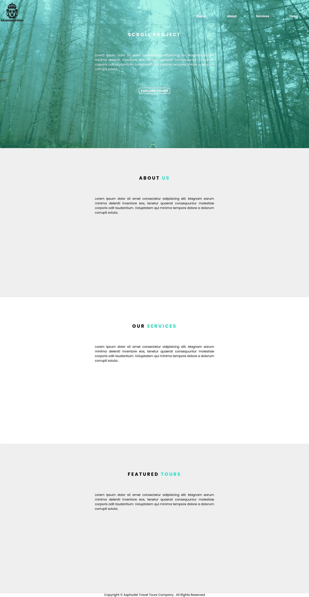

# Review App

Mock up website with a navbar that becomes sticky upon scrolling down, a home button becomes visible once the navbar becomes sticky.  Website is also responsive.

## Screenshot

## Features

- Mobile layout.
- Floating home button displayed upon scrolling down.
- Navbar hides behind a burger icon on mobile layout.
- Navbar sticks to top and changes background color upon scrolling.

## Installation

1. Clone the repository: `git clone https://github.com/AlexdelCarmen/scroll-project`
2. Open the `index.html` file in your web browser.

## Usage

Scroll down to fix the navbar to the top and change its background color.  You can use the displayed home button to return to the top.

## Technologies

Made with:

- HTML
- CSS
- JavaScript

## License

This project is released under the Unlicense. Please read the LICENSE file [License](./LICENSE).

## Credits

Inspired in John Smilga's video for freeCodeCamp `https://youtu.be/3PHXvlpOkf4`
